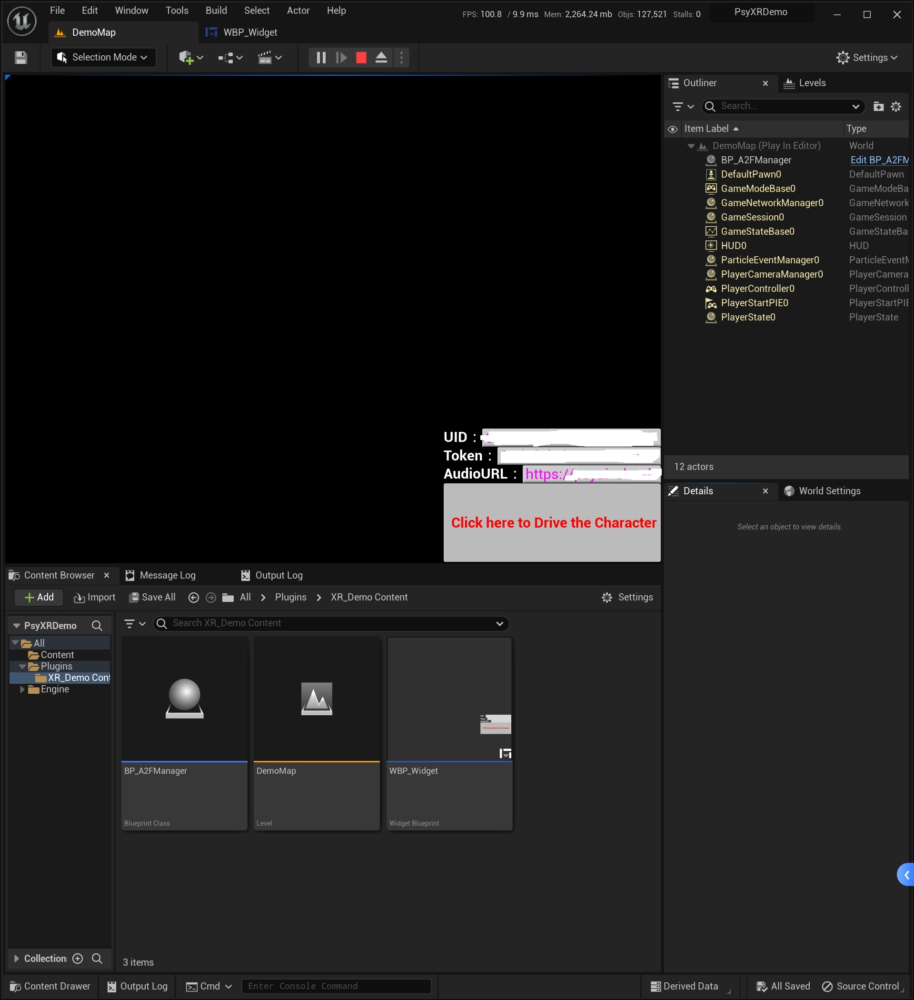
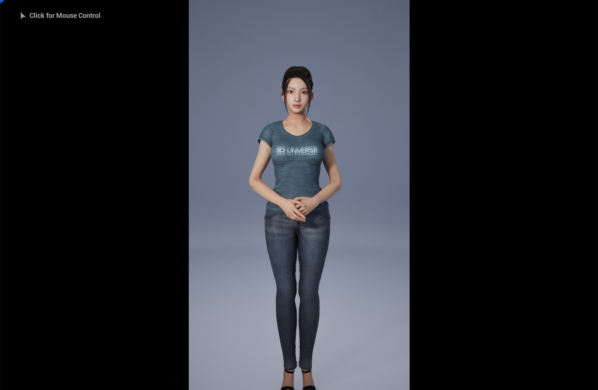
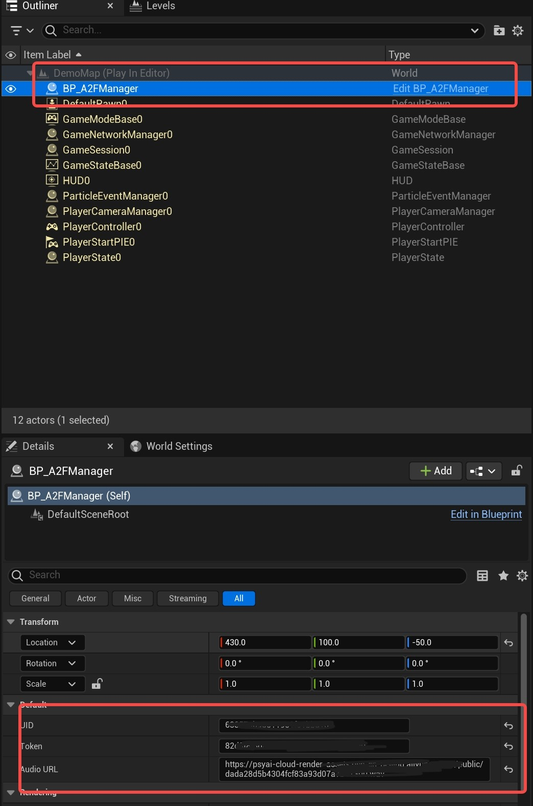

# PsyXRDemo
PsyXR Engine drive demo.

环境：
- Unreal Engine 5.1.1
- Visual Studio 2019 / 2022
- Windows 10 / 11

## 1. 项目介绍
本项目是基于Unreal Engine 5.1.1的Demo，主要用于展示PsyXR引擎的功能。

## 2. 项目结构
- Plugins：插件文件夹
  - XR_Demo：PsyXR接口调用Demo插件
- PsyXRDemo.uproject：项目文件

## 3. 项目使用
1. 下载Unreal Engine 5.1.1
2. 下载PsyXRDemo项目
  - git clone https://github.com/psyai-net/PsyXRDemo.git
3. 打开PsyXRDemo.uproject
4. 运行PsyXRDemo项目（PIE）
5. 填写深锶数智人UID 和 Token(如果没有请联系深锶销售人员)已经服务器上的某一段wav文件的URL
    
    
6. 下载**数智人客户端**
    - [数智人客户端下载地址](https://pan.baidu.com/s/1qjLWVgkA56v6N4HEidXQsg?pwd=7kz1)
7. 启动**数智人客户端**
   
7. 点击PsyXRDemo下的“Click here to Drive Live Character”按钮 ,开始驱动数智人；

## 4. 项目说明
### 4.1. 插件说明
  - XR_Demo插件是PsyXR引擎数据交互以及后端数据交互的Demo插件，主要用于展示如何调用接口深锶后台接口以及**数智人客户端**接口,以使得自定义数据驱动客户端驱动数智人；
  - 如果你想在Demo项目中缓存自己的UID和Token，如下
  

