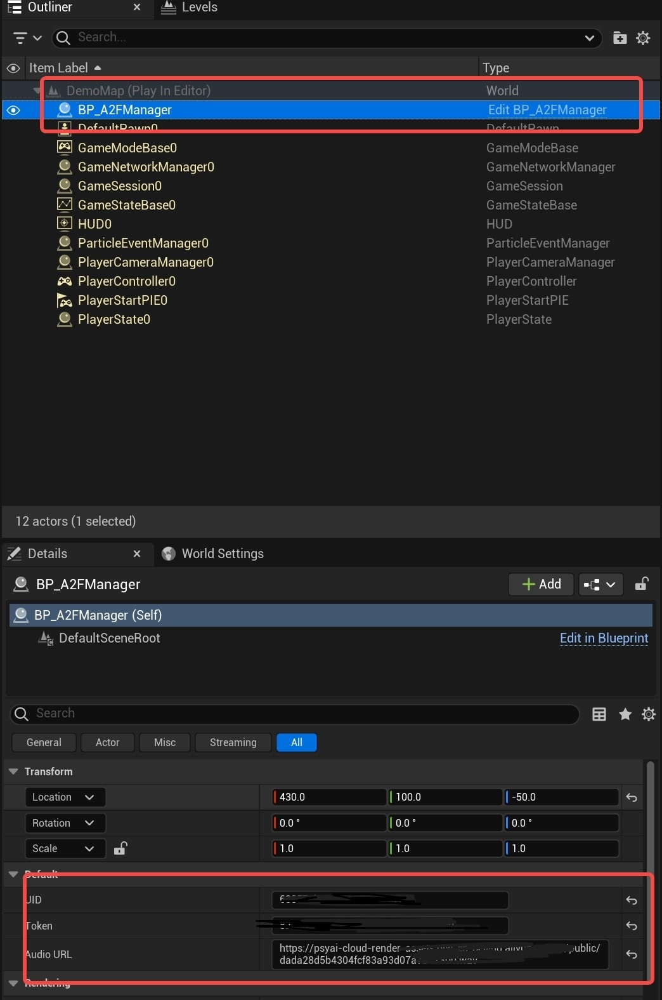

# PsyXRDemo
PsyXR Engine drive demo.

环境：
- Unreal Engine 5.1.1
- Visual Studio 2019 / 2022
- Windows 10 / 11

## 1. 项目介绍
本项目是基于Unreal Engine 5.1.1的Demo，主要用于展示PsyXR引擎的功能。

## 2. 项目结构
- Plugins：插件文件夹
  - XR_Demo：PsyXR接口调用Demo插件
- PsyXRDemo.uproject：项目文件

## 3. 项目使用
1. 下载Unreal Engine 5.1.1
2. 下载PsyXRDemo项目
  - git clone https://github.com/psyai-net/PsyXRDemo.git
3. 打开PsyXRDemo.uproject
4. 运行PsyXRDemo项目（PIE）
5. 填写数智人UID 和 Token已经服务器上的某一段wav文件的URL
    
6. 启动数智人客户端
   
7. 点击“Click here to Drive Live Character”按钮 ,开始驱动数智人

## 4. 项目说明
### 4.1. 插件说明
  - XR_Demo插件是PsyXR引擎的Demo插件，主要用于展示PsyXR引擎的功能,以及如何在虚幻引擎中调用接口，驱动云端数智人；
  - 如果你想在Demo项目中缓存自己的UID和Token，如下
  

